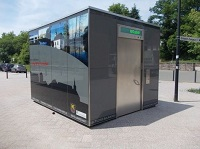

# Marketing Requirements Document (MRD) "Gym Box"

*Mini gym on the street*

*Gym Box* (working title) will serve major metropolitan areas where gym facilities are desired by the work force, Monday through Friday.  In the vein of pop-up restaurants, food trucks, and street vendors, Gym Boxes will, in effect, bring the gym into the area where gym facilities are desired.

** *Prototype*

Each Gym Box will:

- Sit upon a mobile platform that can be moved into and parked in a city neighborhood
- Provide a small array of work-out equipment and possibly other amentities

Gym Boxes will accommodate a single user at a time (possibly two) and can be booked in advance.

## Revenue or Cost Focus

According to the market research team, the business model for the Gym Box would support both individual and group rentals for both revenue generate and cost reduction respectively.

For individuals, a Gym Box would be a revenue generator in a franchise model.  The franchisee would assume financial risks, promote the unit and deliver it to high density neighborhoods where volume would generate profit.  

Alternatively, the group model could be used to reduce costs by increasing employee productivity.  Established companies with 100+ health conscience employees could rent or purchase their own Gym Box, and locate it near their premises, thereby allowing employees to quickly access and then return to work, thereby reducing costs through greater productivity.

## Desire to Innovate

The development of the Gym Box will use a part-renovate and part-innovate design process.  

The concept of just-in-time services such as pop-up restaurants and food trucks will inform many of the design choices that will go into the Gym Box concept in terms of its placement, payment, and promotion.  By understanding consumers' existing expectations of those models, the Gym Box should not be a far stretch to understand. 

On the other hand, the actual product of the Gym Box (basically, the inside) would be completely new innovation.  The **design and operation of the interior** must translate established gym features and practices into a much smaller, more private space.  How and what that will look like will be based on the design research to figure out.

## Length of Time Horizon

Targeting the growing health-conscientious, millennials entering the workforce, and the good weather during the summer, the investors of the Gym Box have established the summer of 2019 as the target for launch of the Gym Box.  

The set-back schedule for the design, development, manufacturing and delivery of the first working Gym Box is as follows:

- Design Process: February through the end of April 2019
- Prototype development and manufacturing: May 2019
- Delivery of the first working Gym Box: June 2019

### Design Schedule Detail

| Activity                                          | Timeframe                |
| ------------------------------------------------- | ------------------------ |
| Design Research                                   | February 2019            |
| User & Domain Analysis (U&DA) Complete            | February 28, 2019        |
| Development of Requirements and Context Scenarios | March 2019 (first half)  |
| Development of Framework and Design Language      | March 2019 (second half) |
| Form & Behavior Specification (F&BS)              | March 28, 2019           |
| Detailed Design Development                       | April 2019               |
| Delivery of final design and presentation         | Late April 2019          |

## Understanding of the Problem

The Gym Box opportunity is based on the frustration of health-conscientious office workers who want to get in and out of a gym quickly, in the middle of a work day.  Conceptually, if workers can't get to the gym, we bring the gym to them.

Although the concept is simple from a high level, **the challenge will be in the design**.  The gym box solution must provide enough benefits in terms of its access, usage, and payment to overcome its limitation in terms of smallness, lack of features, and concerns of privacy and safety.  

Cost of the service will be at a premium compared to regular, big box gyms, but still must provide enough value to justify itself.

## Willingness to Invest

Market research suggest that certain, large city markets will have enough upscale, health-conscientious office workers with disposable income who would pay a premium for Gym Box services.  Therefore, the investors understand the need to provide high-end amenities and creature comforts as part of the Gym Box product.  I.e. no expense should be spared in terms of style, aesthetics, and quality of the experience.

## Risk Factors

Although market research provides a convincing business model, their assumptions are vague when it comes to the details of the exact features within the Gym Box.  They do not know whether the target users prefer free-style equipment or machines (and which kind?), and whether or not the Gym Box should include other amenities such as personal trainers, a shower, or cleaning services.  

The concern by the investors would be, "the devil is in the details," meaning that the concept might be good, but if the box is designed with the wrong features, the product would fail.