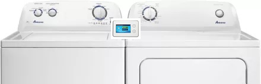

# Marketing Requirements Document (MRD) "Laundry Manager"

*Washer/Dryer interface for college environments*

The *Laundry Manager* product (working title) is an integrated hardware and software solution for use in college laundromats to help students find available machines, and help them do their laundry securely while being fair to other students by optimizing the equipment usage.

 

*Prototype shown atop a generic washer/dryer*

Washers and dryer control will be available through an attached, integrated touch screen with a card-reader, which will also display equipment usage status.  Status and other features will also be available through a web application and native smart phone apps.

The on-machine device will have access to the washers and dryers through an existing API and will be able to control all functions including a door locking mechanism.  

Features of the system will include:

- Status - current availability, and projected availability for specific machines or campus-wide load-balancing
- Reservation capability - controls for *who's next*, with safeguards against abuse of the system
- Remote locking capability - to allow someone to keep a machine's door locked remotely (using a "dead man's switch" application)

...and other capabilities as determined by user research.

## Revenue or Cost Focus

The purpose of the Laundry Manager is strictly for **cost-reduction** because it optimizes equipment usage thereby reducing the need to buy and manage more washer/dryer equipment than absolutely necessary.

A side-effect of the optimization is an increase of user satisfaction since students will spend less time looking for and waiting around to do laundry.  Also, the Laundry Manager will reduce stress, allowing students to worry less about damage or theft to their clothes.

## Desire to Innovate

There are other laundry manager-like products on the market today, however none of them fulfill the specific features of a campus environment.  Whereas public laundromats have many high-capacity machines centrally located, on-campus equipment is typically distributed over a wide area with fewer, lower-capacity machines that must be located first, and then carefully timed (or "baby sat") to protect against removal or possibly theft.  

The Laundry Manager product leverages the best of existing, good-working systems currently on the market, while introducing many innovations such as the ability to provide load-balancing information across all locations, and door-locking mechanisms.  

Also, the use of a booking system for machine scheduling would be a new innovation in this environment..

## Length of Time Horizon

Targeting a beta test over the summer, the stakeholders of the Laundry Manager have established the summer of 2019 as the target for launch.  

The set-back schedule for the design, development, manufacturing and delivery of the Laundry Manager is as follows: 

- Design Process: February through the end of April 2019
- Prototype development and manufacturing: May 2019
- Delivery of the first working set of products: June 2019

### Design Schedule Detail

| Activity                                          | Timeframe                |
| ------------------------------------------------- | ------------------------ |
| Design Research                                   | February 2019            |
| User & Domain Analysis (U&DA) Complete            | February 28, 2019        |
| Development of Requirements and Context Scenarios | March 2019 (first half)  |
| Development of Framework and Design Language      | March 2019 (second half) |
| Form & Behavior Specification (F&BS)              | March 28, 2019           |
| Detailed Design Development                       | April 2019               |
| Delivery of final design and presentation         | Late April 2019          |

## Understanding of the Problem

Even though laundry equipment management and optimization is not new, the particulars of the college campus environment presents new challenges.  Students, many of whom are new to "adulting" may be conflicted in situations caused by other students who are unfamiliar with social protocol. For example, when confronted by laundry left in a machine - do they wait patiently for the owner to remove it? - do they remove someone else's laundry?  What if the owner never comes back?

Also students, many of whom are already stressed by time constraints, have to guess when it's a good time to laundry.  And then they may have to carry their laundry across campus, sometime during inclement weather, just looking for an available washer and dryer.  This plus the need to deal with other people who are less considerate creates an environment of frustration and stress. 

## Willingness to Invest

The target market of the Laundry Manager is universities like the University of Rochester that can afford to provide high-end support to its student population.  As such, the design, including form-factors and technology capabilities should "spare no expense" to make a product that looks and feels comfortable to use and unobtrusive in its design.

## Risk Factors

The concept of "friction free" usage is the greatest concern.  It's understood that students are overwhelmed by their existing workload, plus the never-ending parade of "tools" at their disposal that are supposed to make their college experience easier.  The Laundry Manager would be yet-another in that parade, therefore it's at greatest risk for being ignored if not designed correctly.

Students must view the Laundry Manager as an immediate benefit without a substantial (or any) learning curve.