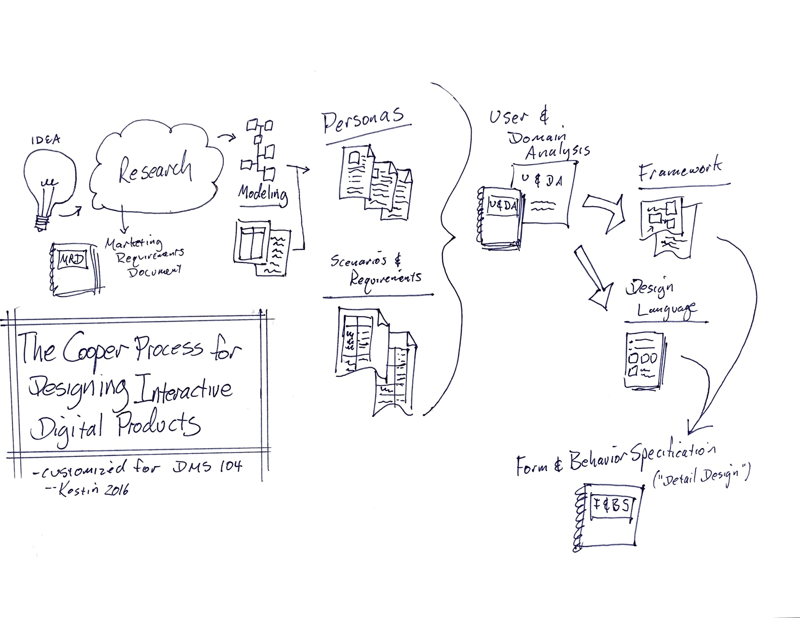

# DMS 104 Book Overview

## Getting Started

### Chapter 1: Goal-Directed Product and Service Design

Overview of the entire book. Defines some basic concepts and terms.

- "Goal-directed design"
- Principles; patterns; process; and practices (this book mostly: process and practice)
- Overview of the goal-directed process:
  - Research
  - Modeling
  - Requirements
  - Framework
  - Detailed design
  - [Note: we're leaving out *Planning* and *Implementation*]

### Chapter 2: Assembling the Team

Definition of the roles & responsibilities, including the *design team*:

- Interaction Designer - Generator (IxDG)
- Interaction Designer - Synthesizer (IxDS)
- Visual Designer (VisD)
- Industrial Designer (ID)
- Team Lead

Assignment: read all of Chapter 2 (16 pages); focus on the roles & responsibilities of the Design Team

Each student chooses their own *initial* design team role; each student prepares a two-minute presentation

###  Chapter 3: Project Planning

Definition of the Marketing Requirement Document (MRD)

- MRD must answer fundamental questions:
  - Will the new product design increase revenue or cut costs?
  - Is the design team being asked to innovate something new or renovate something that exists?
  - What is the time horizon for the design project; when does the design need to be done, or is expected to be done (not counting development nor production time); will this take weeks, months, or years?
  - Are there already specific ideas; is there something(s) that resembles what will be designed?
  - What is the willingness to invest; is this a 'bet the company' project or an experiment to test the market

- Assignment: read Chapter 3 (14 pages); learn about the MRD
- Project 1: Marketing Requirements Document (MRD)

## Research

### Chapter 4: Research Fundamentals

Overview of the Research, chapters, 5-9. Defines concepts and terms.

- Review of common reluctance to doing research
- "Design research" defined; and quantitative vs. qualitative methods
- Overview of common research methods:
  - Usability testing
  - Focus groups
  - Individual interviews <-- the big one in Cooper process
  - Direct observation
- Review of research skills: active listening; data capture

### Chapter 5: Understanding the Business

Introduction to Stakeholders and focusing on **business goals first**

- List of who's who in the organization and tips for each:
  - Marketing
  - Engineering
  - Sales
  - Senior Executives
  - Subject Matter Experts

### Chapter 6: Planning User Research

Focus of this Chapter is on figuring out interviews; who to interview (roles) and how many

- Introduction to the book's sample design problems: (1) LocalGuide; and (2) Room Finder
- Recruiting and scheduling types, and hints & tips

### Chapter 7: Understanding Potential Users and Customers

Focus is on conducting customer interviews

- How to structure user interviews (agenda)
- Examples of questions to ask customers, and how to conduct the interviews
- Need to focus on objects and data that users deal with
- Need to focus on the relationships between them (1:1; 1:n; n:n)
- Focus on actions users need to take with their objects and data
- Use the interview to collect artifacts; photos

### Chapter 8: Example Interview

Complete scripted interview with comments

### Chapter 9: Other Sources of Information and Inspiration

Suggestions of other research methods, besides user interviews

- Public-space observation
- Mystery shopper
- Diaries
- Surveys (a big topic)
- Web Analytics
- Focus groups
- Card sorting
- Competitive analysis
- Literature and media

## Modeling

### Chapter 10: Making Sense of Your Data: Modeling

Focus is on taking large amounts of notes and artifacts and then grouping and distilling them into usable chunks so the design team can make informed decisions

- Summarize stakeholder findings
- Condense user data quantitatively and qualitatively
  - Qualitatively: do single-case analysis (look at individuals); and cross-case analysis (look at groups and trends)
  - Single case analysis
    - "Code" interviews
    - Make activity diagrams and decision trees
    - Define taxonomies
  - Cross-case analysis
    - Personas (detailed in Chapter 11)
    - Affinity diagrams and composite models
  - Quantitatively: statistical analysis (for large enough data)

### Chapter 11: Personas

Detail on why and how to create personas, a type of cross-case analysis

- Steps...
  - divide by roles
  - id behavioral and demographics variables
  - map interviewees to variables
  - id patterns
  - define goals
  - clarify and add detail
  - add other types as needed
  - group and prioritize
  - write narratives

- Personas provide...
  - scenarios
  - mental models
  - goals
  - environments
  - skills

## Requirements

### Chapter 12: Defining Requirements

About the definition of requirements and the process of turning research (models and personas) into requirements using techniques...

  - Brainstorming
  - Creating context scenarios

- Requirements define the products...
  - data needs
  - functional needs
  - product qualities
  - constraints
  - experience attributes

### Chapter 13: Putting It All Together: The User and Domain Analysis

How to create a User and Domain Analysis which summarizes into a document and presentation: 

- Research findings
- Personas
- Scenarios
- Requirements 

## Framework

### Chapter 14: Framework Definition: Visualizing Solutions

Overview of the Framework chapters: 15-16 (interaction); 17-18 (design language); and 19 (communication)

- Focus on structure, not details 
- Good to have sketching and storyboarding skills and tools
- Decide between novel and known platform
- Suggestions on how to brainstorm and develop

### Chapter 15: Principles and Patterns for Framework Design

Covers principles (ground rules) for defining a good Framework and patterns (examples) of typical frameworks

- Principles...
  - has value (ethical; purposeful; pragmatic; elegant)
  - minimizes work (cognitive; visual; memory; physical)

- Patterns...
  - command line
  - organizer/workspace
  - hub-and-spoke or hierarchical
  - parallel
  - multiple document interface
  - first-person environment
  - third-person environment

### Chapter 16: Designing the Form Factor and Interaction Framework

This is where the details of the solution start to get fleshed-out

- IxDG and IxDS focus on objects and data (from research); use charts to define: relationships; states; actions; and attributes
- Whole team: list functional needs and create functional elements for each (create things users will see and interact with)
- Team: Create (sketch) the platform
- ID: refine the form factor
- IxDG and IxDS: Define the interaction framework; sketch/diagram key path scenarios

### Chapter 17: Principles and Patterns in Design Language

Covers principles (ground rules) for defining a good design language and patterns (examples) of typical design languages

- Principles...
  - meaning from context and information
  - affordance
  - purpose
  - unity
  - "smallest effective difference"
- Patterns...
  - color; size; shape
  - line weight and style
  - type; texture
  - images; materials

### Chapter 18: Developing the Design Language

This is where the details of the solution's look & feel get fleshed-out

- Goal: tie experience attributes to design choices for each element that gets designed
- VisD and ID decide general direction(s) and elements to design
- VisD and ID decide how to represent primary attributes and secondary attributes

### Chapter 19: Communicating the Framework and Design Language

How to create a summary of the framework and design language into a document and presentation: 

- Framework
- Design Language
- Include past information and decisions RE personas, scenarios, requirements; tie framework and design language decisions to earlier findings

## Detailed Design

### Chapter 20: Detailed Design: Making Your Ideas Real

Overview of the Detailed Design chapters, 21-24

- Defines principles when moving forward (important things to keep in mind)
- Summarizes project management methods: waterfall; agile

### Chapter 21: Detailed Design Principles and Patterns

Covers principles (ground rules) for detailed design, and patterns (examples) of detailed design

- Principles...
  - Unassuming and unobtrusive, but anticipating needs (like a waiter)
  - Common sense
- Patterns (communicating with users)...
  - flow; priority; relationships (CRAP principles ...not in this book)
  - information design: data; state (position)
  - use of icons, text/type, and "widgets" (micro interactions)
  - dealing with a lot of data (presenting large data sets)
  - dealing with different kinds of interfaces (e.g. audible; speech; touch)

### Chapter 22: Detailed Design Process and Practices

This is where the actual work of design takes place by the designers through individual (or sub-team) work and full-team reviews:

- Interaction design (IxDG, IxDS)- mostly done in the framework definition
- Visual design (VisD) - going from sketches to detailed comps (a lot of work)
  - grid
  - layout (frames, surfaces, dimensionality)
  - hierarchy of content and controls
- Industrial design (ID)
  - form and function
  - ergonomics

### Chapter 23: Evaluating Your Design

This is the part of the process when the team gets external feedback to ensure the detailed design is correct

- Focus groups
- Expert reviews
- Usability testing

### Chapter 24: Communicating Detailed Design

How to create a Form and Behavior Specification which summarizes into a document and presentation: 

- Detailed Design (all the details, in the document - the presentation, not so much)
- (Again?) include past information and decisions RE personas, scenarios, requirements; tie framework and design language decisions to earlier findings
